# NIO-Netty

### BIO 编程

Block-IO

文件IO或者网络IO

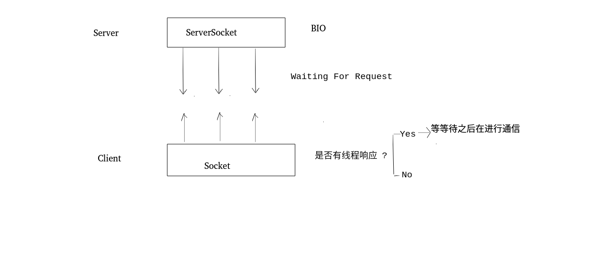

##### BIO-Client (基于TCP)

```java
package com.abelrose;

import java.io.InputStream;
import java.io.OutputStream;
import java.net.Socket;
import java.util.Scanner;

//BIO 客户端程序
public class TCPClient {
	public static void main(String[] args) throws Exception {
		while (true) {
			//1.创建Socket对象
			Socket s = new Socket("127.0.0.1", 9999);
			//2.从连接中取出输出流并发消息
			OutputStream os = s.getOutputStream();
			System.out.println("请输入:");
			Scanner sc = new Scanner(System.in);
			String msg = sc.nextLine();
			os.write(msg.getBytes());
			//3.从连接中取出输入流并接收回话
			InputStream is = s.getInputStream(); //阻塞 等待服务器返回数据 如果没有返回就一直等待
			byte[] b = new byte[20];
			is.read(b);
			System.out.println("老板说:" + new String(b).trim());
			//4.关闭
			s.close();
		}
	}
}

```

##### BIO-Server

```java
package com.abelrose;

import java.io.InputStream;
import java.io.OutputStream;
import java.net.ServerSocket;
import java.net.Socket;

//BIO 服务器端程序
public class TCPServer {
	public static void main(String[] args) throws Exception {
		//1.创建ServerSocket对象
		ServerSocket ss=new ServerSocket(9999); //端口号

		while (true) {
			//2.监听客户端
			System.out.println("来呀");
			Socket s = ss.accept(); //阻塞 正在监听客户端连接 如果没有客户端连接就一直等待
			System.out.println("来呀");
			//3.从连接中取出输入流来接收消息
			InputStream is = s.getInputStream(); //阻塞
			byte[] b = new byte[10];
			is.read(b);
			String clientIP = s.getInetAddress().getHostAddress();
			System.out.println(clientIP + "说:" + new String(b).trim());
			//4.从连接中取出输出流并回话
			//OutputStream os = s.getOutputStream();
			//os.write("没钱".getBytes());
			//5.关闭
			//s.close();
		}
	}
}


```

### NIO 编程

Non-blocking IO (After JDK1.4)

BIO是以流的方式处理数据 NIO是以块的方式(Channel Buffer)处理数据(效率高很多)

三大核心*:**Channel Buffer Selector***

##### 文件IO


Buffer 实际上是一个容器(特殊的数组)  能够***记录*** 和***跟踪* **缓冲区的状态变化情况,读写必须经过Buffer

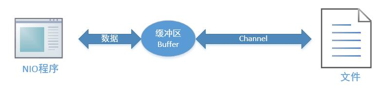

在NIO中,Buffer是一个顶层父类,他是一个抽象类,常用子类有:

- ByteBuffer:存储字节数据到缓存(最常用)

  ​	主要方法:

   - public abstract ByteBuffer put(byte[] b); 存储字节数据到缓冲区
   - public abstract byte[] get(); 从缓冲区获得字节数据
   - public final byte[] array(); 把缓冲区数据转换成字节数组
   - public static ByteBuffer allocate(int capacity); 设置缓冲区的初始容量
   - public static ByteBuffer wrap(byte[] array); 把一个现成的数组放到缓冲区中使用
   - public final Buffer flip(); 翻转缓冲区,重置位置到初始位置

- ShortBuffer:存储字符串数据到缓存

- CharBuffer:存储字符数据到缓冲区
- IntBuffer:存储整数数据到缓冲区
- LongBuffer:存储长整型数据到缓冲区
- DoubleBuffer:存储小数到缓冲区
- FloatBuffer:存储小数到缓冲区


Channel 类似于 BIO 中的Stream(单向的input/output) NIO中的Channel是双向的(可读可写)

- FileChannel:文件读写
  - public int read(ByteBuffer dst) ,从通道读取数据并放到缓冲区中
  - public int write(ByteBuffer src) ,把缓冲区的数据写到通道中
  - public long transferFrom(ReadableByteChannel src, long position, long count),从目标通道中复制数据到当前通道
  - public long transferTo(long position, long count,WritableByteChannel target),把数据从当前通道复制给目标通道
- DatagramChannel:UDP读写
- ServerSocketChannel:TCP读写
- SocketChannel:TCP读写

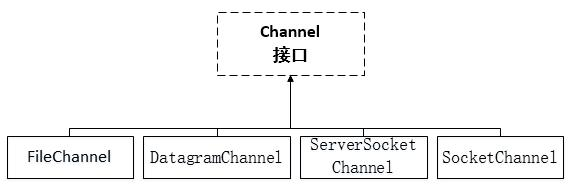

文件操作

```java
package com.abelrose;

import org.junit.Test;

import java.io.File;
import java.io.FileInputStream;
import java.io.FileOutputStream;
import java.nio.ByteBuffer;
import java.nio.channels.FileChannel;

// 通过NIO实现文件IO
public class TestNIO {
    @Test  // 在本地文件中写数据
    public void test1() throws Exception{
        //1.创建输出流
        FileOutputStream fos = new FileOutputStream("demo.txt"); // 往这个文件中写数据、
        //2.从流中得到通道(通道是从流中创建得到的)
        FileChannel fc = fos.getChannel();
        //3.提供一个缓冲区
        ByteBuffer buffer = ByteBuffer.allocate(1024); // 注意这个不是new出来的 是静态方法
        //4.往缓冲区中存数据
        String str = "hello,NIO";
        buffer.put(str.getBytes()); // str.getBytes() 把一个字符串转换成字节数组
        //5.翻转缓冲区
        buffer.flip(); // 要不然不从头开始读字符串 从最后开始读 是空的
        //6.把缓冲区写到通道中
        fc.write(buffer);
        //7.关闭
        fos.close(); // 关闭流的时候就已经把通道关闭了
    }

    @Test // 从本地文件中读取数据
    public void test2() throws Exception{
        //0.将文件封装 为了在缓冲区中能够调用文件的大小
        File file = new File("demo.txt");
        //1.创建输入流
        FileInputStream fis = new FileInputStream(file);
        //2.得到一个通道
        FileChannel fc = fis.getChannel();
        //3.提供一个缓冲区
        ByteBuffer buff = ByteBuffer.allocate((int) file.length()); // 以文件的大小作为缓冲区的大小
        //4.从通道里读取数据 并存到缓冲区中
        fc.read(buff); // 最终数据是在缓冲区里面
        //5.打印到控制台上
        System.out.println(new String(buff.array()));
        //6.关闭流即可
        fis.close();
    }

    /** 注意FileChannel fc = fos.getChannel();
    *   fc.write() 和 fc.read() 的区别
    */
    
    @Test // 使用NIO实现文件复制
    public void test3() throws Exception{
        //1.创建两个流
        FileInputStream fis = new FileInputStream("demo.txt");
        FileOutputStream fos = new FileOutputStream("demo-copy.txt");
        //2.得到两个通道
        FileChannel sour = fis.getChannel();
        FileChannel dest = fos.getChannel();
        //3.复制
        dest.transferFrom(sour,0,sour.size());  // 适合复制大文件
//        sour.transferTo(dest,0,sour.size());
        //4.关闭
        fis.close();
        fos.close();
    }
}
```


##### 网络IO

学习 NIO 主要就是进行网络 IO,Java NIO 中的网络通道是非阻塞 IO 的实现

基于事件驱动,非常适用于服务器需要***维持大量连接***,但是数据交换量不大的情况,例如一些***即时通信的服务***

Selector(选择器)-俗称通道管理大师,能够检测多个注册的通道上是否有事件发生,如果有事件发生,便获取事件然后针对每个事件进行相应的处理。

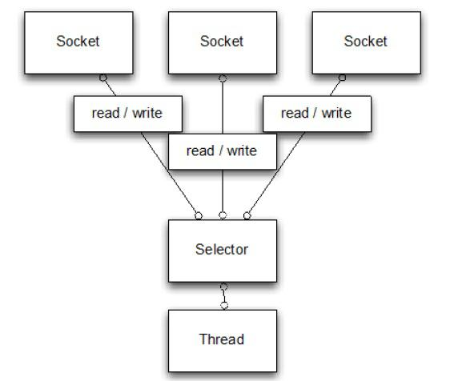

优点:

- 大大地减少了系统开销,并且不必为每个连接都创建一个线程,不用去维护多个线程,
- 避免了多线程之间的上下文切换导致的开销

常用方法:

- public static Selector ***open()***,得到一个选择器对象
- public int select(***long timeout***),监控所有注册的通道,当其中有 IO 操作可以进行时,将对应的 SelectionKey 加入到内部集合中并返回,参数用来设置超时时间
- public Set<SelectionKey> ***selectedKeys()***,从内部集合中得到所有的SelectionKey 代表了Selector和通道之间的注册关系
  - int OP_ACCEPT有新的网络连接可以 accept,值为 16
  - int OP_CONNECT:代表连接已经建立,值为 8
  - int OP_READ 和 int OP_WRITE:代表了读、写操作,值为 1 和 4


ServerSocketChannel

在服务器端监听新的客户端 Socket 连接

- public static ServerSocketChannel ***open()***,得到一个 ServerSocketChannel 通道
- public final ServerSocketChannel ***bind***(SocketAddress local),设置服务器端端口号
- public final SelectableChannel ***configureBlocking***(boolean block),设置阻塞或非阻塞模式,取值 false 表示采用非阻塞模式
- public SocketChannel ***accept()***,接受一个连接,返回代表这个连接的通道对象
- public final SelectionKey ***register***(Selector sel, int ops),注册一个选择器并设置监听事件

SocketChannel

网络 IO 通道,具体负责进行读写操作(缓冲区-通道或者通道-缓冲区)

- public static SocketChannel ***open()***,得到一个 SocketChannel 通道

- public final SelectableChannel ***configureBlocking***(boolean block),设置阻塞或非阻塞模式,取值 false 表示采用非阻塞模式

- public boolean ***connect***(SocketAddress remote),连接服务器

- public boolean ***finishConnect()***,如果上面的方法***连接失败***,接下来就要通过该方法完成连接操作

- public int ***write***(ByteBuffer src),往通道里写数据

- public int ***read***(ByteBuffer dst),从通道里读数据

- public final SelectionKey ***register***(Selector sel, int ops, Object att),注册一个选择器并设置监听事件,最后一个参数可以设置共享数据

- public final void close(),关闭通道

  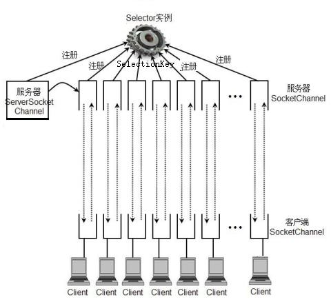

  

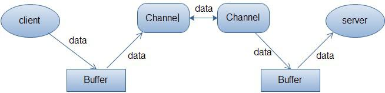


##### NIO-Clinet

```java
package com.abelrose;

import java.net.InetSocketAddress;
import java.net.Socket;
import java.nio.ByteBuffer;
import java.nio.channels.SocketChannel;

// 网络客户端程序
public class NIOClient {
    public static void main(String[] args) throws Exception{
        //1.得到一个网络通道
        SocketChannel channel = SocketChannel.open();
        //2.设置非阻塞方式
        channel.configureBlocking(false); // 采用非阻塞的方式
        //3.提供服务器端的IP和端口号
        InetSocketAddress address = new InetSocketAddress("127.0.0.1", 9999);
        //4.连接服务器端
        if(!channel.connect(address)){
            while (!channel.finishConnect()){ // NIO作为非阻塞式的优势 -> 在连接的时候还可以做别的事情
                System.out.println("Client: 我还可以做别的事情...");
            }
        }
        //5.得到一个缓冲区
        String msg = "hello,Server";
        ByteBuffer wrap = ByteBuffer.wrap(msg.getBytes());// 字节数组
        //6.发送数据 到服务器端
        channel.write(wrap);
        // 注意暂时不能关闭通道 需要服务器的处理
        System.in.read();
    }
}
```


##### NIO-Server

```java
package com.abelrose;

import java.net.InetSocketAddress;
import java.net.ServerSocket;
import java.nio.channels.SelectionKey;
import java.nio.channels.Selector;
import java.nio.channels.ServerSocketChannel;
import java.util.Iterator;

// 服务器端程序
public class NIOServer {
    public static void main(String[] args) throws Exception{
        //1.得到一个ServerSockectChannel对象 服务器端老大
        ServerSocketChannel serverSocketChannel = ServerSocketChannel.open();
        //2.得到一个Selector对象 间谍
        Selector selector = Selector.open();
        //3.绑定一个端口号
        serverSocketChannel.bind(new InetSocketAddress(9999));
        //4.设置非阻塞方式
        serverSocketChannel.configureBlocking(false);
        //5.把得到一个ServerSocketChannel对象 注册给 selector对象
        serverSocketChannel.register(selector, SelectionKey.OP_ACCEPT);
        //6. 淦 !!!
        while (true){
            //6.1 监控客户端
            if(selector.select(2000) == 0){ // 监控是否有客户端  NIO非阻塞式的优势
                System.out.println("Server: 如果没有客户端我就可以做些别的事情");
                continue;
            }
            //6.2 得到Selectionkey 判断通道的事件
            Iterator<SelectionKey> keyIterator = selector.selectedKeys().iterator();
            while (keyIterator.hasNext()){
                SelectionKey key = keyIterator.next();
                if(key.isAcceptable()){ // 客户端连接事件 能不能连
                }
                if(key.isReadable()){ // 读取客户端事件 能不能读
                }
            }
        }
    }
}
```

------

##### 案例:网络多人聊天案例

ChatServer

```java
package com.abelrose.chat;

import java.io.IOException;
import java.net.InetSocketAddress;
import java.nio.ByteBuffer;
import java.nio.channels.*;
import java.text.SimpleDateFormat;
import java.util.*;

//聊天程序服务器端
public class ChatServer {
    private ServerSocketChannel listenerChannel; //监听通道  老大
    private Selector selector;//选择器对象  间谍
    private static final int PORT = 9999; //服务器端口

    public ChatServer() {
        // 最基本的额五个步骤
        try {
            // 1. 得到监听通道  老大
            listenerChannel = ServerSocketChannel.open();
            // 2. 得到选择器  间谍
            selector = Selector.open();
            // 3. 绑定端口
            listenerChannel.bind(new InetSocketAddress(PORT));
            // 4. 设置为非阻塞模式
            listenerChannel.configureBlocking(false);
            // 5. 将选择器绑定到监听通道并监听accept事件
            listenerChannel.register(selector, SelectionKey.OP_ACCEPT);
            printInfo("Chat Server is ready.......");
        } catch (IOException e) {
            e.printStackTrace();
        }
    }

    //6. 干活儿 淦 ! ! !
    public void start() throws Exception {
        try {
            while (true) { //不停监控
                if (selector.select(2000) == 0) {
                    System.out.println("Server:没有客户端找我， 我就干别的事情");
                    continue;
                }
                Iterator<SelectionKey> iterator = selector.selectedKeys().iterator();
                while (iterator.hasNext()) {
                    SelectionKey key = iterator.next();
                    if (key.isAcceptable()) { //连接请求事件
                        SocketChannel sc = listenerChannel.accept(); // 接受连接 返回这个连接的通道对象
                        sc.configureBlocking(false);
                        sc.register(selector, SelectionKey.OP_READ);
                        System.out.println(sc.getRemoteAddress().toString().substring(1) + "上线了...");
                    }
                    if (key.isReadable()) { //读取数据事件
                        readMsg(key); // 从指定的key中读取数据
                    }
                    //一定要把当前key删掉，防止重复处理
                    iterator.remove();
                }
            }
        } catch (IOException e) {
            e.printStackTrace();
        }
    }

    //读取客户端发来的消息并广播出去
    public void readMsg(SelectionKey key) throws Exception {
        SocketChannel channel = (SocketChannel) key.channel();
        ByteBuffer buffer = ByteBuffer.allocate(1024);
        int count = channel.read(buffer);
        if (count > 0) {
            String msg = new String(buffer.array());
            printInfo(msg);
            // 发广播 需要两个参数 第一个是当前的通道(需要排除掉) 另一个是广播的信息
            broadCast(channel, msg);
        }
    }

    //给所有的客户端发广播(除了自己) 说实话就i是向通道中写数据
    public void broadCast(SocketChannel except, String msg) throws Exception {
        System.out.println("服务器发送了广播...");
        // 目前有多少个通道 通过selector
        for (SelectionKey key : selector.keys()) { // 返回所有就绪的通道 就是已经连上的通道
            Channel targetChannel =  key.channel(); // 找到所有已经就绪的通道 注意这个地方不能直接强转(有可能是各种各样的通道) 需要用父类接收一下
            // 排除自身
            if(targetChannel!=except && targetChannel instanceof SocketChannel){
                // 发广播 就是写数据
                SocketChannel destChannel = (SocketChannel) targetChannel; // 如果是SocketChannel 那么进行强转;
                ByteBuffer buffer = ByteBuffer.wrap(msg.getBytes()); // 传到缓冲区
                destChannel.write(buffer);
            }
        }
    }

    private void printInfo(String str) { //往控制台打印消息
        SimpleDateFormat sdf = new SimpleDateFormat("yyyy-MM-dd HH:mm:ss");
        System.out.println("[" + sdf.format(new Date()) + "] -> " + str);
    }

    public static void main(String[] args) throws Exception {
        new ChatServer().start();
    }
}

```

ChatClient

```java
package cn.itcast.nio.chat;

import java.io.IOException;
import java.net.InetSocketAddress;
import java.nio.ByteBuffer;
import java.nio.channels.SelectionKey;
import java.nio.channels.Selector;
import java.nio.channels.SocketChannel;
import java.util.Iterator;
import java.util.Set;

//聊天程序客户端
public class ChatClient {
    private final String HOST = "127.0.0.1"; //服务器地址
    private int PORT = 9999; //服务器端口
    private SocketChannel socketChannel; //网络通道
    private String userName; //聊天用户名

    public ChatClient() throws IOException {
        //1. 得到一个网络通道
        socketChannel=SocketChannel.open();
        //2. 设置非阻塞方式
        socketChannel.configureBlocking(false);
        //3. 提供服务器端的IP地址和端口号
        InetSocketAddress address=new InetSocketAddress(HOST,PORT);
        //4. 连接服务器端
        if(!socketChannel.connect(address)){
            while(!socketChannel.finishConnect()){  //nio作为非阻塞式的优势
                System.out.println("Client:连接服务器端的同时，我还可以干别的一些事情");
        }
        }
        //5. 得到客户端IP地址和端口信息，作为聊天用户名使用
        userName = socketChannel.getLocalAddress().toString().substring(1);
        System.out.println("---------------Client(" + userName + ") is ready---------------");
    }

    //向服务器端发送数据
    public void sendMsg(String msg) throws Exception{
        if(msg.equalsIgnoreCase("bye")){  // 如果发送了bye 那么关闭
            socketChannel.close();
            return;
        }
        msg = userName + "说:" + msg;  // 做一个拼接
        ByteBuffer buffer = ByteBuffer.wrap(msg.getBytes());  // 通道已经有了 需要重新创建一个Buffer
        socketChannel.write(buffer);
    }

    //从服务器端接收数据
    public void receiveMsg() throws Exception { // 直接从通道中拿数据就可以了
        ByteBuffer buffer = ByteBuffer.allocate(1024);
        int size = socketChannel.read(buffer);
        if(size > 0){
            String msg = new String(buffer.array());
            System.out.println(msg.trim());
        }
    }
}

```

TestChat

```java
package cn.itcast.nio.chat;

import java.util.Scanner;

//启动聊天程序客户端
public class TestChat {
    public static void main(String[] args) throws Exception {
        ChatClient chatClient = new ChatClient();

        // 接收数据
        new Thread(){  // 匿名内部类 创建一个单独的线程 用于接收官博过来的消息
            @Override
            public void run() {
                while (true){
                    try {
                        chatClient.receiveMsg();
                        Thread.sleep(2000);
                    } catch (Exception e) {
                        e.printStackTrace();
                     }
                }
            }
        }.start();

        // 给服务器端发送消息
        Scanner scanner = new Scanner(System.in);
        while (scanner.hasNextLine()){
            String msg = scanner.nextLine();
            chatClient.sendMsg(msg);
        }
    }
}

```

------

##### AIO 编程

Asynchronous IO (JDK1.7) 两种模式:Reactor(NIO)和Proactor

## IO 对比总结

- BIO 方式适用于连接数目比较小且固定的架构,这种方式对服务器资源要求比较高,并发局限于应用中,JDK1.4 以前的唯一选择,但程序直观简单易理解。
  - 同步阻塞:你到饭馆点餐,然后在那等着,啥都干不了,饭馆没做好,你就必须等着!
- NIO 方式适用于连接数目多且连接比较短(轻操作)的架构,比如***聊天服务器***,并发局限于应用中,编程比较复杂,JDK1.4 开始支持。
  - 同步非阻塞:你在饭馆点完餐,就去玩儿了。不过玩一会儿,就回饭馆问一声:好了没啊!
- AIO 方式使用于连接数目多且连接比较长(重操作)的架构,比如***相册服务器***,充分调用 OS 参与并发操作,编程比较复杂,JDK7 开始支持。
  - 异步非阻塞:饭馆打电话说,我们知道您的位置,一会给你送过来,安心玩儿就可以了,类似于现在的外卖。

| 对比总结     | BIO      | NIO                  | AIO        |
| ------------ | -------- | -------------------- | ---------- |
| IO 方式      | 同步阻塞 | 同步非阻塞(多路复用) | 异步非阻塞 |
| API 使用难度 | 简单     | 复杂                 | 复杂       |
| 可靠性       | 差       | 好                   | 好         |
| 吞吐量       | 低       | 高                   | 高         |

------

### Netty

由JBOSS开发,提供异步的、基于事件驱动的网络应用程序框架,用于开发高性能,高可靠性的网络IO程序.

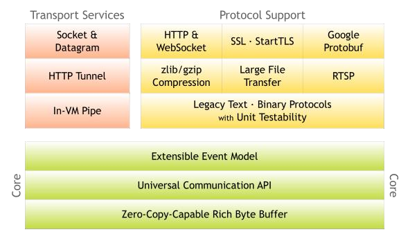

##### Netty整体设计

***线程模型***

- 单线程(NIO网络聊天室案例就是这种模型)

  用***一个线程***通过多路复用搞定所有IO

  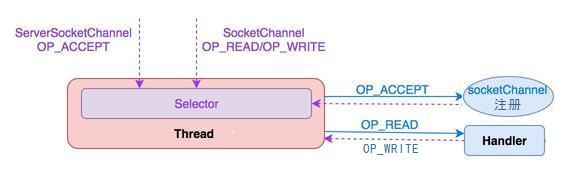

- 线程池

  一个线程专门处理 客户端连接请求

  一个线程池负责IO操作

  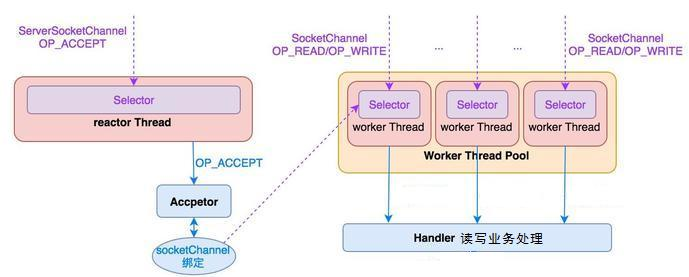

- Nettey模型

  两个线程池 Bossroup 和 WorkerGruop

  Bossroup: 接收客户端连接

  WorkerGruop:  负责网络读写操作

  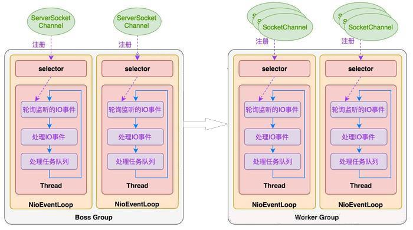

  NioEventLoop 表示一个不断循环执行处理任务的线程,每个都包含一个selector 用于监听socket网络通信

  NioEventLoop 内部采用***串行化设计***,

  从消息的读取->解码->处理->编码->发送,始终由 IO 线程 NioEventLoop 负责。

  - 一个 NioEventLoopGroup 下包含多个 NioEventLoop
  - 每个 NioEventLoop 中包含有一个 Selector,一个 taskQueue
  - 每个 NioEventLoop 的 Selector 上可以注册监听多个 NioChannel
  - 每个 NioChannel 只会绑定在唯一的 NioEventLoop 上
  - 每个 NioChannel 都绑定有一个自己的 ChannelPipeline

##### ***异步模型***

FUTURE  CALLBACK  HANDLER

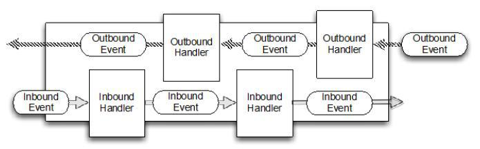


##### ***核心API***


